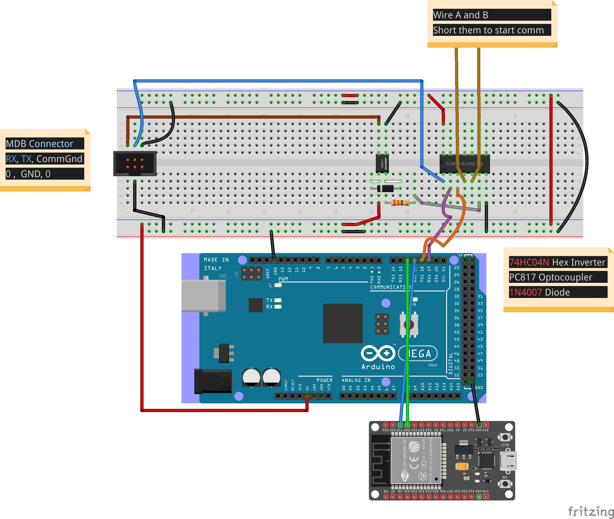

# MQTT To MDB Bridge
## Atmega2560 Code(Arduino Mega)

## Pre Requirements
 
 The following should be installed in your PC
 
  - AVR-GCC
  - AVRDUDE
  - avr-libc

### Setup

  1. Open terminal in the atmega2560FW folder and execute `make clean`
  2. Open makefile, replace P=COM1 to the COM port of your arduino mega and save the file
  2.2 Compile it with `make all`
  3. Upload it to your Arduino with `make program`

## ESP32 Code
## Pre Requirements

You should have Arduino IDE Installed

  1.  Add ESP32 Board to your Arduino IDE
    1. In your Arduino IDE, go to File> Preferences
        Installing ESP32 Add-on in Arduino IDE Windows, Mac OS X, Linux open preferences
    2. Enter ```https://dl.espressif.com/dl/package_esp32_index.json``` into the “Additional Board Manager URLs” field then, click the “OK” button:
    Note: if you already have the ESP8266 boards URL, you can separate the URLs with a comma as follows:
    ```https://dl.espressif.com/dl/package_esp32_index.json,
      http://arduino.esp8266.com/stable/package_esp8266com_index.json```
    3. Open the Boards Manager. Go to Tools > Board > Boards Manager…
    4. Search for ESP32 and press install button for the “ESP32 by Espressif Systems“:
    5. That’s it. It should be installed after a few seconds.

  2.  Now copy the contents of the libs folder to the libraries directory of your Arduino
    1. If you are using windows, the libraries directory will be Documents/Arduino/libraries
  3.  Select ESP32 Dev Kit from Tools->Board->ESP32 Dev Kit
  4.  Select the correct port from Tools->Port
  5.  Then in ESP32FW.ino file, on line number 13 and 14, put your WiFi creds
  6.  Upload the Code to your ESP32

  ```diff
  + broker used is borker.hivemq.com
  + vending can be done by publishing an ammount to mdb/invoke topic
  ```
  Note: for more details, you can see MQTTHandler.h file


## Circuit Diagram
Short Wire A and Wire B to start the MDB communication or put an on/off button


The parts used in this circuit are:

* Optocoupler __OHPC 817C F919G__
* * [Datasheet](https://www.farnell.com/datasheets/73758.pdf)
* Schimitt Trigger Hex Inverter __PHILIPS 74HC14N B9784PS Hnn9840 E__
* * [Datasheet](https://datasheet.octopart.com/74HC14N-Philips-datasheet-7274161.pdf)
* Diode __1N4007 MIC AXIAL SILASTIC GUARD JUNCTION STANDARD RECTIFIER__
* * [Datasheet](https://rdd-tech.com/sites/default/files/attachment/1N4007%20MIC.pdf)
* Resistor 330 ohms
* Arduino Mega 2560
* ESP32 Dev Kit


